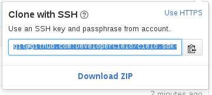
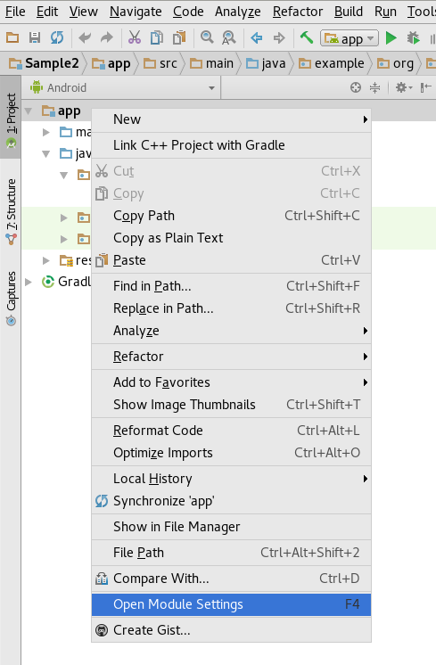
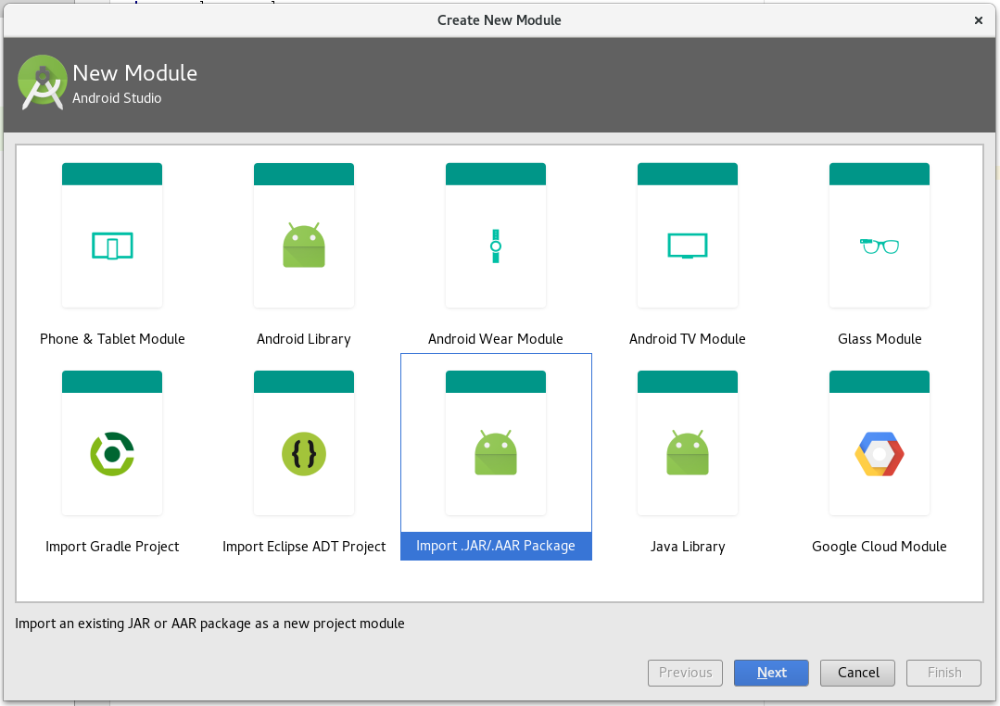
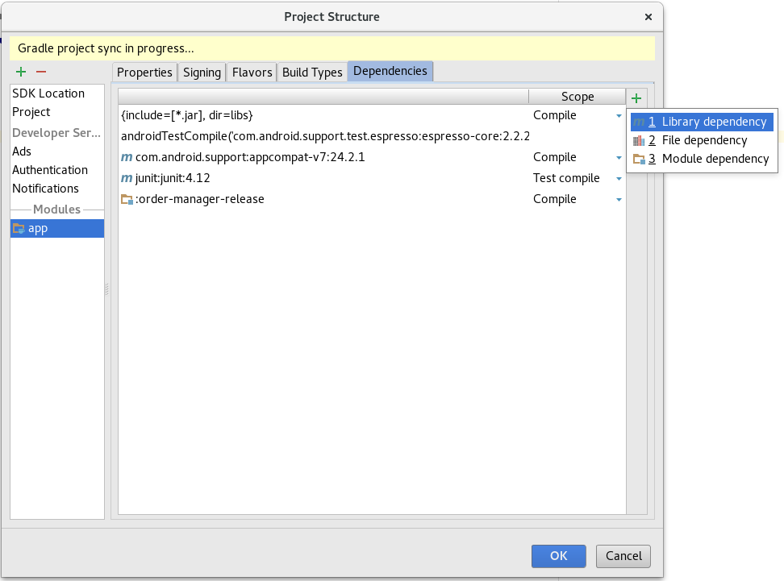
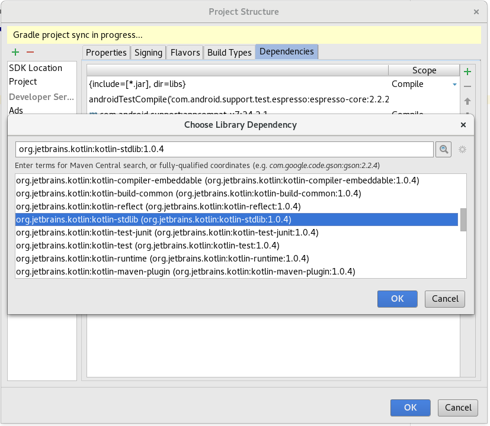
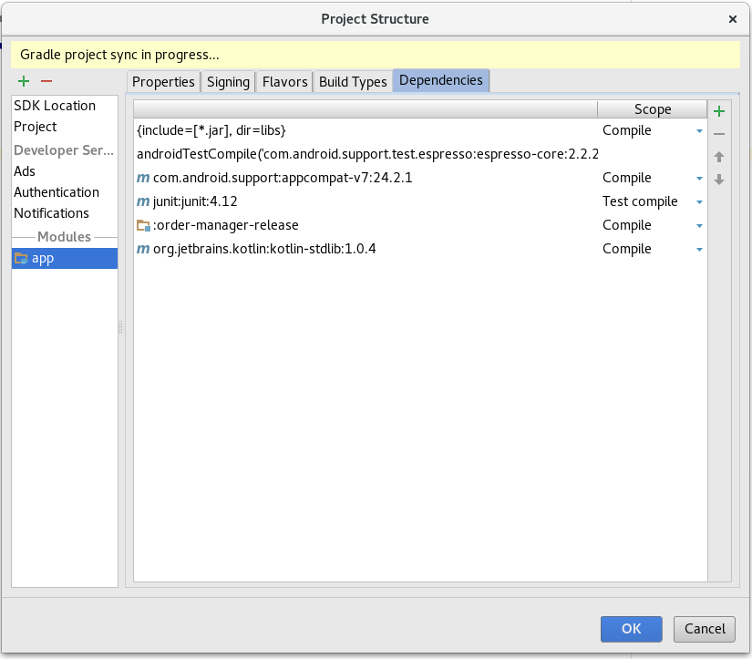

# Introdução

O objetivo desta documentação é orientar o desenvolvedor sobre o método de integração utilizando o Cielo Lio Order Manager SDK. O Cielo Lio Order Manager SDK permite que aplicações parceiras se integrem à plataforma da Cielo Lio na cloud de forma simples, rápida e segura . Nesse documento você vai encontrar todas as informações necessárias para realizar a integração com nossa plataforma de forma rápida e segura.

Em linhas gerais, o Cielo Lio Order Manager SDK é uma solução de pedidos e pagamento projetada para aumentar a conversão das vendas, simplificar o processo de compra, reduzir fraudes e custos operacionais. Nesta documentação estão descritas todas as funcionalidades desta integração, os parâmetros técnicos e principalmente os códigos de exemplos para facilitar o seu desenvolvimento.

O nosso SDK permite ao desenvolvedor e parceiro Cielo Lio desenvolver aplicações se integrando a plataforma utilizando uma API de alto nível e amigável ao desenvolvedor. Porém, internamente, o SDK implementa a API REST da plataforma Cielo Lio.

## Cielo Lio Order Manager API

A API RESTful do Order Management permite que aplicações parceiras se integrem à plataforma da Cielo/M4U na cloud. Nesse documento você vai encontrar todas as informações necessárias para realizar a integração com nossa plataforma de forma rápida e segura.

Todas as APIs foram construídas utilizando as boas práticas do padrão RESTful que é amplamente utilizado pelo mercado. Nas próximas secções, você terá a descrição de todas as APIs dos serviços de Pedidos da Cielo/M4U, como também as Entidades expostas como recursos REST, de forma que você possa acessar através de semântica HTTP padrão. Códigos de status HTTP são usadas para comunicar o sucesso / falhas e estados. Todas as nossas APIs utilizam um esquema de requisições e respostas com payload no formato JSON.

Nesse manual você encontrará a referência sobre todas as operações disponíveis na API REST. Estas operações devem ser executadas utilizando suas credenciais nos ambientes de [staging](#Staging) ou [produção](#Produção):

### Ambientes

A Cielo Lio provem dois ambientes básicos de trabalho:

#### SandBox

O ambiente de Staging é destinado à realização de testes com parceiros da M4U. Esse ambiente usa simuladores de integração, sendo assim as operações não são executadas em ambiente produtivo.

#### Produção

O ambiente de Produção é o ambiente transacional na rede pública. As operações realizadas nesse ambiente não podem ser desfeitas.

# Cielo Lio Order Manager SDK

Para começar a utilizar o Order Manager Cielo Lio SDK, basta incluir as seguintes dependências no seu projeto do Android Studio:

```
dependencies {
   compile 'cielo.sdk:ordermanager:1.1.0'
   compile 'org.jetbrains.kotlin:kotlinstdlib:1.0.4'
}
```

## Inclusão das dependências

Faça um clone do SDK através do Github:

```
git clone git@github.com:DeveloperCielo/cielo.sdk-ordermanager.git
```

Ou o download do .ZIP acessando o [repositório](https://github.com/DeveloperCielo/cielo.sdk-ordermanager) e clicando em *Clone or download*:



### Abra as configurações do módulo da aplicação

Após fazer o download, abra o Android Studio e, então, as configurações do módulo na sua aplicação.



### Adicione um novo módulo

Na nova janela, adicione um novo módulo.


### Importe o SDK do Order Management

Na nova tela, selecione *Import .JAR/.AAR Package* para importar o SDK.



### Adicione as dependências

* Order Management
* Kotlin stdlib





## Packages e classes

Após a inclusão das dependências, as seguintes classes e enumerações estarão disponíveis:

Classe | Descrição
--------|----------
`cielo.sdk.order.Credentials`|Credenciais de acesso do Parceiro/Desenvolvedor.
`cielo.sdk.order.Environment`|Ambiente de conexão
`cielo.sdk.order.Item`|Representação do item do pedido
`cielo.sdk.order.Order`|Representação do pedido que será enviado para a API Order Manager
`cielo.sdk.order.OrderManager`|Interface que representa a API Order Manager
`cielo.sdk.order.UnitOfMeasure`|Unidade de medida do item do pedido
`cielo.sdk.order.payment.Payment`|Representação de um pagamento d pedido
`cielo.sdk.order.payment.PaymentError`|Representação de um erro
`cielo.sdk.order.payment.PaymentListener`|Um callback que informa sobre todas as ações tomadas durante o processo de pagamento.
`cielo.sdk.order.payment.PaymentOptions`|Opções do pagamento

### Environment

* `Environment.PRODUCTION`
* `Environment.SANDBOX`

### UnitOfMeasure

* `UnitOfMeasure.EACH`
* `UnitOfMeasure.HOURS`
* `UnitOfMeasure.DAYS`
* `UnitOfMeasure.SECONDS`
* `UnitOfMeasure.CRATE_OF_12`
* `UnitOfMeasure.SIX_PACK`
* `UnitOfMeasure.GALLON`
* `UnitOfMeasure.LITRE`

### PaymentOptions

* `PaymentOptions.ALLOW_ONLY_CREDIT_PAYMENT`
* `PaymentOptions.ALLOW_ONLY_CHIP_PAYMENT`
* `PaymentOptions.ALLOW_ONLY_DEBIT_PAYMENT`

## Utilização do SDK

Uma vez tendo adicionado a dependência do SDK ao seu projeto, você está pronto para continuar e inicializar o SDK. O SDK necessita basicamente de 3 parâmetros para sua inicialização:

Parâmetro | Descrição | Domínio
----------|-----------|--------
`credentials`|Credenciais de acesso do Parceiro/Desenvolvedor. Quando você se registra como um parceiro credenciado Cielo Lio, você recebe essas credenciais, elas servem para identificá­-lo unicamente na plataforma Lio.|`cielo.sdk.order.Credentials`
`environment`|Ambiente de conexão:<ul><li>Produção</li><li>Sandbox</li></ul>|`cielo.sdk.order.Environment`
`options`| Um Map com opções de configuração. Por exemplo, se você só quiser permitir que o pagamento seja seja feito usado Credito à Vista ou se quer limitar a quantidade de parcela para no máximo 4, é através do desse objeto que você poderá informar a Lio sobre algumas configurações personalizadas.|`Map<String, Object>`

```java
// ...
Map<String, Object> options = new HashMap<>();

OrderManager orderManager = new OrderManager(
   new Credentials(accessKeyId, secretAccessKey),
   Environment.SANDBOX,
   options
);
// ...
```

Após inicializar o order manager, é preciso vincular o contexto ao serviço de pagamento do SDK; para isso utiliza­se o método bind(Context context). Lembrando que é preciso desvincular o contexto da aplicação para que não haja problemas de integridade; basta usar o método unbind() conforme demonstrado no exemplo.

```java
// vincular o contexto
orderManager.bind(this);
// ...
// desvincular o contexto
orderManager.unbind();
// ...
```

Uma vez tendo inicializado o OrderManager, você está pronto para manipular os pedidos. Vamos agora criar um pedido no estado draft e depois adicionar item a esse pedido.

```java
orderManager.createDraftOrder("Identificador do Pedido na Lio");

String sku = "2891820317391823";
String name = "Coca­-cola lata";
int unitPrice = 550;
int quantity = 3;

order.addItem(sku, name, unitPrice, quantity, UnitOfMeasure.EACH);
```

Com os itens adicionados ao pedido podemos atualizá-lo e liberá-lo para pagamento:

```java
/// ...
orderManager.updateOrder(order);
orderManager.placeOrder(order);
/// ...
```

Note que após esse passo o pedido já vai está disponível na lista de pedidos da Cielo Lio para pagamento e finalmente podemos iniciar o processo de pagamento do pedido:

```java
orderManager.checkoutOrder(order,
    ALLOW_ONLY_CREDIT_PAYMENT | ALLOW_ONLY_CHIP_PAYMENT,
    new PaymentListener() {
        @Override
        public void onStart() {
            // O pagamento começou
        }

        @Override
        public void onPayment(Payment payment) {
            // Um pagamento foi realizado
        }

        @Override
        public void onCancel() {
            // A operação foi cancelada
        }

        @Override
        public void onSuccess() {
            // O checkout terminou
        }

        @Override
        public void onError(PaymentError error) {
            // O checkout falhou
        }
    });
```